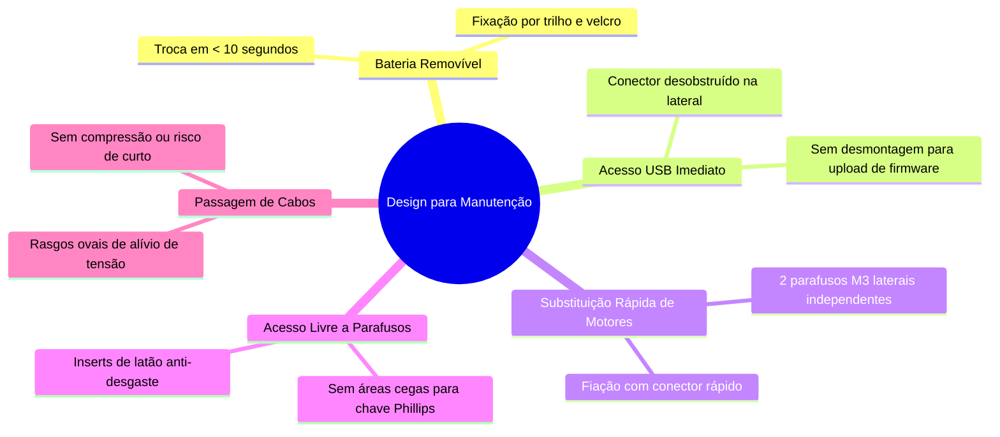

<div align="center">

# 🤖 Documentação Técnica — Carrinho-Robô 2WD
### FIAP — Engenharia de Software | Disciplina: Project-based Maker Lab
**Profª Dra. Gedeane G.S. Kenshima** (`profgedeane.kenshima@fiap.com.br`)

[](https://github.com/rcm2005/MakerLabTechnicalDoc.git)
[]()
[-blue?style=for-the-badge)]()

---

</div>

## 👥 1. Identificação do Grupo e Repositório

| Integrante | RM / Identificação | Responsabilidade Principal |
| :--- | :---: | :--- |
| **Rafael Carvalho Mattos** | RM 99874 | Arquitetura de Hardware, Documentação Técnica & Repositório |
| **Rafael Autieri dos Anjos** | RM 550885 | Firmware Arduino, Lógica de Controle & Sensores |
| **Luiza Cristina Silva** | RM 99367 | Modelagem Estrutural, Croqui & Especificações Mecânicas |
| **Levy Nascimento Junior** | RM 98655 | Eletrônica de Potência, Integração de Hardware & Testes |

> 🔗 **Link Oficial do Repositório no GitHub:**  
> [https://github.com/rcm2005/MakerLabTechnicalDoc.git](https://github.com/rcm2005/MakerLabTechnicalDoc.git)

---

## 📑 2. Índice da Documentação

1. [Ficha de Requisitos do Carrinho-Robô](#-3-ficha-de-requisitos-do-carrinho-robô)
2. [Tabela Dimensional Oficial (Aula 15)](#-4-tabela-dimensional-oficial)
3. [Croqui Técnico Estrutural e Vistas com Cotas](#-5-croqui-técnico-do-chassi)
4. [Diretrizes de Fabricação Digital e Tolerâncias](#-6-diretrizes-de-fabricação-e-tolerâncias-dimensionais)
5. [Design para Manutenção: Modelo B vs Modelo A](#-7-design-para-manutenção-modelo-b-funcional)
6. [Arquitetura Eletroeletrônica e Conexões](#-8-arquitetura-eletroeletrônica-e-pinagem)
7. [Documentos Técnicos Complementares](#-9-documentos-técnicos-complementares)

---

## 📋 3. Ficha de Requisitos do Carrinho-Robô

Abaixo estão definidos os parâmetros fundamentais de projeto do robô móvel com tração diferencial de 2 rodas:

```
                                  FICHA TÉCNICA
┌────────────────────────────────────────┬────────────────────────────────────────────────────────┐
│ PARÂMETRO                              │ ESPECIFICAÇÃO ADOTADA                                  │
├────────────────────────────────────────┼────────────────────────────────────────────────────────┤
│ Dimensões Totais do Robô               │ 220 mm (C) × 200 mm (L) × 85 mm (A)                    │
│ Dimensões da Base do Chassi            │ 200 mm (C) × 150 mm (L) × 3,0 mm (Espessura)           │
│ Vão Livre do Solo (Ground Clearance)   │ 20,0 mm                                                │
│ Quantidade e Tipo de Motores           │ 2x Motores DC Amarelos TT c/ Caixa de Redução 1:48     │
│ Rodas de Tração                        │ 2x Rodas de Borracha Ø 65 mm × 26 mm                   │
│ Ponto de Apoio Auxiliar                │ 1x Roda Boba (Caster Wheel) Frontal Ø 25 mm            │
│ Placa Controladora Principal           │ Arduino Uno R3 (Microcontrolador ATmega328P)           │
│ Módulo Driver de Potência              │ Ponte H Dupla L298N (com dissipador térmico)           │
│ Fonte de Alimentação                   │ Pack 2x Células Li-ion 18650 em série (7.4V nominal)   │
│ Sistema de Sensoriamento de Distância  │ 1x Sensor Ultrassônico HC-SR04 (Sonar Frontal)         │
│ Comunicação e Controle Remoto          │ 1x Módulo Bluetooth HC-05 (UART Serial 9600 bps)       │
│ Massa Total Estimada                   │ ~420 g (com baterias instaladas)                       │
└────────────────────────────────────────┴────────────────────────────────────────────────────────┘
```

---

## 📏 4. Tabela Dimensional Oficial

Em conformidade com a atividade solicitada no slide 13 da **Aula 15 – Mecânica**:

| Componente | Comprimento (mm) | Largura (mm) | Altura (mm) | Massa (g) | Forma de Fixação Mecânica Adotada |
| :--- | :---: | :---: | :---: | :---: | :--- |
| **Motor Esquerdo (TT Amarelo)** | 70,0 | 22,4 | 19,0 | 30 g | 2x Parafusos M3 x 30 mm passantes com suporte "L" lateral |
| **Motor Direito (TT Amarelo)** | 70,0 | 22,4 | 19,0 | 30 g | 2x Parafusos M3 x 30 mm passantes com suporte "L" lateral |
| **Arduino Uno R3** | 68,6 | 53,4 | 15,0 | 25 g | 4x Parafusos M3 x 8 mm em espaçadores de nylon de 6 mm |
| **Ponte H (Driver L298N)** | 43,5 | 43,5 | 27,0 | 26 g | 4x Parafusos M3 x 10 mm com arruelas isolantes |
| **Bateria (Suporte 2x 18650)** | 76,0 | 41,0 | 20,0 | 110 g | Encaixe tipo trilho deslizante com fita de velcro rápida |
| **Sensor Ultrassônico (HC-SR04)** | 45,0 | 20,0 | 15,0 | 9 g | Encaixe de pressão frontal com trava em suporte PLA |
| **Roda Boba (Caster Wheel Ø25mm)**| 38,0 | 32,0 | 35,0 | 22 g | 4x Parafusos M3 x 10 mm fixados na parte inferior frontal |
| **2x Rodas Principais (Ø65mm)** | Ø 65,0 | 26,5 | Ø 65,0 | 76 g (par) | Acoplamento no eixo duplo D travado por parafuso central |

---

## 📐 5. Croqui Técnico do Chassi

O projeto do chassi foi estruturado em software de precisão com cotas normalizadas em milímetros, apresentando as vistas **Superior (Planta)** e **Lateral (Elevação)**:

```
+========================================================================================+
|                    CROQUI TÉCNICO ESTRUTURAL — VISTA SUPERIOR (TOP VIEW)               |
+========================================================================================+
                                 [ HC-SR04 Frontal ]
                                     | 45mm x 20mm |
                               +---------------------+
                               |                     |
                               |   ( Roda Boba )     |
                               |      Ø 25 mm        |
                               |                     |
                  +------------+                     +------------+
                  |                                               |
                  |          +-------------------------+          |
      [ USB ] <---|---       |     ARDUINO UNO R3      |          |
   (Acesso Livre) |          |       68.6 x 53.4       |          |
                  |          +-------------------------+          |
                  |                                               |
  +------------+  |          +---------+     +---------+          |  +------------+
  |    RODA    |  |          | PONTE H |     | BATERIA |          |  |    RODA    |
  |  Ø 65 mm   |==|==========|  L298N  |     | 2x18650 |==========|==|  Ø 65 mm   |
  |  (Esquerda)|  |  [MOTOR] | 43 x 43 |     | 76 x 41 | [MOTOR]  |  |  (Direita) |
  +------------+  +----------+---------+-----+---------+----------+  +------------+
                  |<----------------- L = 150 mm ---------------->|
                  |<================ Bitola = 200 mm =============>|
```

### 🖼️ Planta Vetorial de Engenharia (Render SVG)

O diagrama oficial em alta resolução com todas as cotas milimétricas encontra-se em [`assets/chassi_croqui_tecnico.svg`](assets/chassi_croqui_tecnico.svg):

<p align="center">
  
</p>

---

## 🛠️ 6. Diretrizes de Fabricação e Tolerâncias Dimensionais

Para garantir que as peças fabricadas em **Impressão 3D (FDM)** ou **Corte a Laser (Acrílico / MDF)** encaixem perfeitamente sem retrabalho manual, foram adotadas as tolerâncias dimensionais abordadas na Aula 15:

| Tipo de Encaixe | Folga / Offset CAD | Aplicação no Chassi |
| :--- | :---: | :--- |
| **Encaixe Muito Justo (*Press-fit*)** | **+0,1 a +0,2 mm** | Alojamento dos sensores e sedes sextavadas para porcas M3 |
| **Encaixe Deslizante (*Sliding-fit*)** | **+0,2 a +0,4 mm** | Trilho do berço da bateria e suportes intercambiáveis |
| **Peças Móveis / Articulações** | **+0,3 a +0,5 mm** | Pivô giratório da roda boba e folga dos eixos de tração |
| **Furação para Parafusos M3** | **Ø 3,2 a 3,4 mm** | Evita travamento da rosca em furos de passagem estruturais |
| **Espessura de Parede Mínima** | **$\ge$ 3,0 mm** | Previne delaminação ou quebra estrutural sob impacto |

---

## 🔧 7. Design para Manutenção (Modelo B Funcional)

Seguindo o princípio do **"Do Bonito ao Funcional"** (Aulas 14 e 15), o projeto rejeitou a carcaça fechada do Modelo A e priorizou a manutenção prática do **Modelo B**:



---

## ⚡ 8. Arquitetura Eletroeletrônica e Pinagem

```
                                ARDUINO UNO R3
                            +--------------------+
              (PWM ENA) D5 -|                    |- 5V  ----> VCC (Sensores & BT)
             (Motor E+) D6 -|                    |- GND ----> GND Comum
             (Motor E-) D7 -|                    |
             (Motor D+) D8 -|                    |- D11 <---- ECHO (Sonar HC-SR04)
             (Motor D-) D9 -|                    |- D12 ----> TRIG (Sonar HC-SR04)
              (PWM ENB) D10-|                    |- D2  <---- TXD (Bluetooth HC-05)
                            +--------------------+
```

---

## 📂 9. Documentos Técnicos Complementares

A documentação completa e detalhada foi particionada nos seguintes arquivos de especificação:

- 📄 [`docs/01-ficha-de-requisitos.md`](docs/01-ficha-de-requisitos.md) — Ficha técnica aprofundada, requisitos de sistema e justificativas de engenharia.
- ⚙️ [`docs/02-especificacao-mecanica-e-tolerancias.md`](docs/02-especificacao-mecanica-e-tolerancias.md) — Regras de fabricação digital, compensações térmicas e análise de manutenibilidade.
- 📐 [`docs/03-croqui-e-layout-estrutural.md`](docs/03-croqui-e-layout-estrutural.md) — Coordenadas cartesianas de furação, vistas explodidas e análise cinemática.
- ⚡ [`docs/04-esquematico-eletrico.md`](docs/04-esquematico-eletrico.md) — Diagrama unifilar, dimensionamento da bateria e filtragem de ruído.
- 🎨 [`assets/chassi_croqui_tecnico.svg`](assets/chassi_croqui_tecnico.svg) — Arquivo vetorial master do croqui em escala com cotas milimétricas.

---

<div align="center">
<b>FIAP — Engenharia de Software | Project-based Maker Lab</b><br>
<i>Projeto desenvolvido com base nas diretrizes das Aulas 14 e 15 da Profª Dra. Gedeane Kenshima.</i>
</div>
