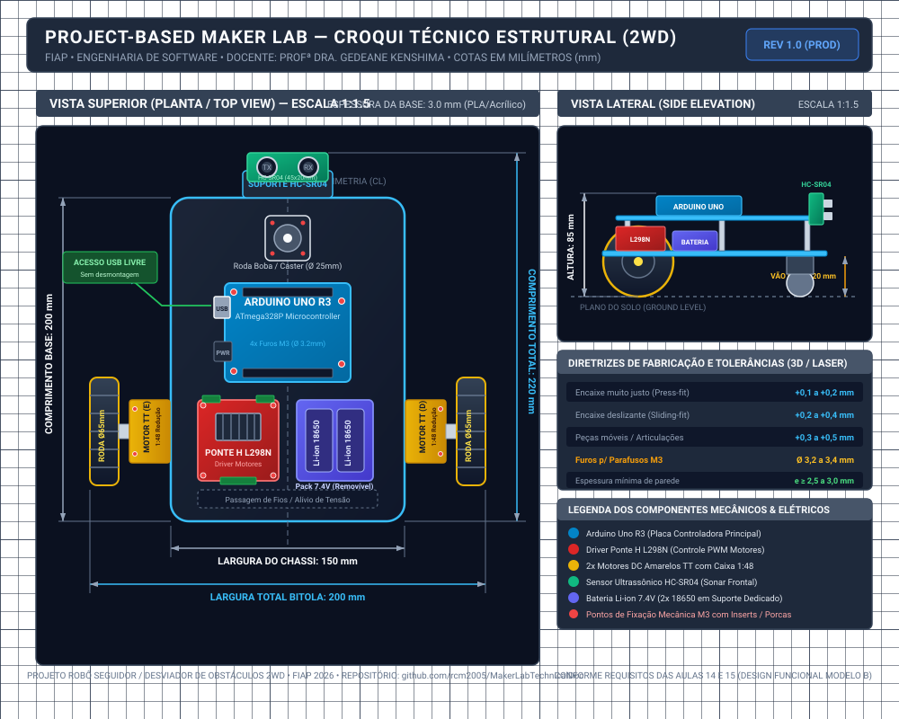
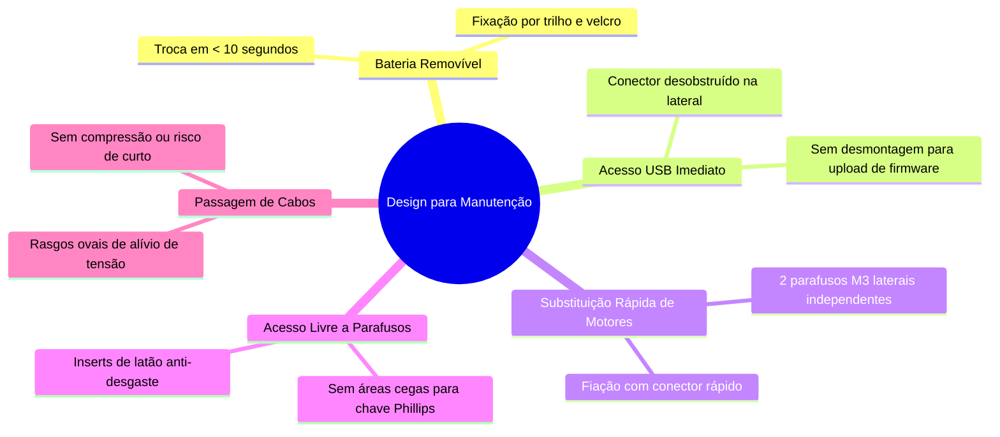
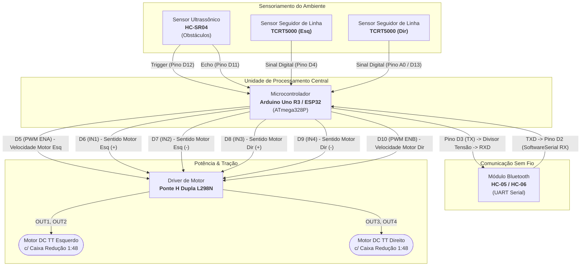
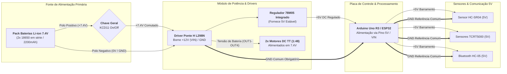

<div align="center">

# 🤖 Documentação Técnica — Carrinho-Robô 2WD
### FIAP — Engenharia de Software | Disciplina: Project-based Maker Lab
**Profª Dra. Gedeane G.S. Kenshima** (`profgedeane.kenshima@fiap.com.br`)

[](https://github.com/rcm2005/MakerLabTechnicalDoc.git)
[]()
[-blue?style=for-the-badge)]()

---

</div>

## 👥 1. Identificação do Grupo e Repositório

| Integrante | RM / Identificação | Responsabilidade Principal |
| :--- | :---: | :--- |
| **Rafael Carvalho Mattos** | RM 99874 | Arquitetura de Hardware, Documentação Técnica & Repositório |
| **Rafael Autieri dos Anjos** | RM 550885 | Firmware Arduino, Lógica de Controle & Sensores |
| **Luiza Cristina Silva** | RM 99367 | Modelagem Estrutural, Croqui & Especificações Mecânicas |
| **Levy Nascimento Junior** | RM 98655 | Eletrônica de Potência, Integração de Hardware & Testes |

> 🔗 **Link Oficial do Repositório no GitHub:**  
> [https://github.com/rcm2005/MakerLabTechnicalDoc.git](https://github.com/rcm2005/MakerLabTechnicalDoc.git)

---

## 📑 2. Índice da Documentação

1. [Ficha de Requisitos do Carrinho-Robô](#-3-ficha-de-requisitos-do-carrinho-robô)
2. [Tabela Dimensional e Fixação de Componentes (com Datasheets)](#-4-tabela-dimensional-e-fixação-de-componentes)
3. [Croqui Técnico Estrutural e Vistas com Cotas](#-5-croqui-técnico-do-chassi)
4. [Diretrizes de Fabricação Digital e Tolerâncias](#-6-diretrizes-de-fabricação-e-tolerâncias-dimensionais)
5. [Design para Manutenção: Modelo B vs Modelo A](#-7-design-para-manutenção-modelo-b-funcional)
6. [Diagramas do Sistema (Blocos e Alimentação)](#-8-diagramas-do-sistema-blocos-e-alimentação)
7. [Documentos Técnicos Complementares](#-9-documentos-técnicos-complementares)

---

## 📋 3. Ficha de Requisitos do Carrinho-Robô

Abaixo estão definidos os parâmetros fundamentais de projeto do robô móvel com tração diferencial de 2 rodas:

```
                                  FICHA TÉCNICA
┌────────────────────────────────────────┬────────────────────────────────────────────────────────┐
│ PARÂMETRO                              │ ESPECIFICAÇÃO ADOTADA                                  │
├────────────────────────────────────────┼────────────────────────────────────────────────────────┤
│ Dimensões Totais do Robô               │ 220 mm (C) × 200 mm (L) × 85 mm (A)                    │
│ Dimensões da Base do Chassi            │ 200 mm (C) × 150 mm (L) × 3,0 mm (Espessura)           │
│ Vão Livre do Solo (Ground Clearance)   │ 20,0 mm                                                │
│ Quantidade e Tipo de Motores           │ 2x Motores DC Amarelos TT c/ Caixa de Redução 1:48     │
│ Rodas de Tração                        │ 2x Rodas de Borracha Ø 65 mm × 26 mm                   │
│ Ponto de Apoio Auxiliar                │ 1x Roda Boba (Caster Wheel) Frontal Ø 25 mm            │
│ Placa Controladora Principal           │ Arduino Uno R3 (Microcontrolador ATmega328P) / ESP32   │
│ Módulo Driver de Potência              │ Ponte H Dupla L298N (com dissipador térmico)           │
│ Fonte de Alimentação                   │ Pack 2x Células Li-ion 18650 em série (7.4V nominal)   │
│ Sistema de Sensoriamento de Distância  │ 1x Sensor Ultrassônico HC-SR04 (Sonar Frontal)         │
│ Sistema Seguidor de Linha (Opcional)   │ 2x Sensores Infravermelhos TCRT5000                    │
│ Comunicação e Controle Remoto          │ 1x Módulo Bluetooth HC-05 (UART Serial 9600 bps)       │
│ Massa Total Estimada                   │ ~420 g (com baterias instaladas)                       │
└────────────────────────────────────────┴────────────────────────────────────────────────────────┘
```

---

## 📏 4. Tabela Dimensional e Fixação de Componentes

Em conformidade com a atividade solicitada no slide 13 da **Aula 15 – Mecânica**, a tabela abaixo apresenta o levantamento dimensional completo de todos os componentes estruturais e eletrônicos do projeto, suas massas estimadas, formas de fixação mecânica e links diretos para os respectivos *datasheets* e especificações técnicas oficiais:

| Componente | Comprimento (mm) | Largura (mm) | Altura (mm) | Massa Estimada (g) | Forma de Fixação Mecânica Adotada | Datasheet / Referência Técnica |
| :--- | :---: | :---: | :---: | :---: | :--- | :---: |
| **Placa Arduino Uno R3** | 68,6 | 53,4 | 15,0 | 25 g | 4x Parafusos M3 x 8 mm em espaçadores (*standoffs*) de nylon de 6 mm | [Datasheet Uno R3 (ATmega328P)](https://docs.arduino.cc/resources/datasheets/A000066-datasheet.pdf) |
| **Placa ESP32 (DevKit V1)** *(Opção)* | 51,0 | 28,0 | 14,0 | 10 g | 4x Parafusos M3 ou Encaixe direto em mini Protoboard | [Datasheet ESP32 (Espressif)](https://www.espressif.com/sites/default/files/documentation/esp32_datasheet_en.pdf) |
| **Motor DC Gear (TT Motor 1:48)** | 70,0 | 22,4 | 19,0 | 30 g (cada) | 2x Parafusos M3 x 30 mm passantes com suporte "L" lateral | [Specs TT Motor DC](https://components101.com/motors/tt-motor-smart-car-gear-motor) |
| **Ponte H (Driver L298N)** | 43,5 | 43,5 | 27,0 | 26 g | 4x Parafusos M3 x 10 mm com arruelas isolantes na base | [Datasheet L298N (ST)](https://www.sparkfun.com/datasheets/Robotics/L298_H_Bridge.pdf) |
| **Sensor Ultrassônico (HC-SR04)** | 45,0 | 20,0 | 15,0 | 9 g | Suporte vertical em PLA/Acrílico com trava de pressão (*snap-fit*) | [Datasheet HC-SR04](https://components101.com/sensors/hc-sr04-ultrasonic-sensor) |
| **Sensor Seguidor de Linha (TCRT5000)** | 35,0 | 10,0 | 15,0 | 5 g (cada) | Parafusos M3 na face inferior do chassi voltados para o solo | [Datasheet TCRT5000 (Vishay)](https://www.vishay.com/docs/83760/tcrt5000.pdf) |
| **Módulo Bluetooth (HC-05 / HC-06)** | 37,3 | 15,5 | 4,0 | 4 g | Fita dupla-face 3M / presilha no deck superior | [Datasheet HC-05](https://components101.com/wireless/hc-05-bluetooth-module) |
| **Slot de Bateria (Pack 2x 18650)** | 76,0 | 41,0 | 20,0 | 110 g (c/ células) | Encaixe tipo gaveta/trilho deslizante e cinta de velcro rápida | [Datasheet Li-ion 18650](https://www.ineltro.ch/media/downloads/sae/panasonic/18650.pdf) |
| **Slot de Bateria (4x AA)** *(Alternativo)* | 58,0 | 62,0 | 15,0 | 85 g (c/ pilhas) | Fita dupla face industrial ou parafusos M3 escareados | [Specs Suporte 4x AA](https://components101.com/misc/aa-battery-holder) |
| **Roda Boba (Caster Wheel Ø25mm)** | 38,0 | 32,0 | 35,0 | 22 g | 4x Parafusos M3 x 10 mm fixados na parte inferior dianteira | [Specs Roda Boba](https://components101.com/misc/caster-wheel-mechanics) |
| **2x Rodas Tratoras (Ø65mm)** | Ø 65,0 | 26,5 | Ø 65,0 | 76 g (par) | Acoplamento sob pressão no eixo duplo "D" c/ parafuso central | [Specs Roda 65mm TT](https://components101.com/misc/smart-car-wheel) |
| **Chave Gangorra Geral (KCD11)** | 15,0 | 10,5 | 19,0 | 3 g | Encaixe por pressão (*snap-in*) na borda lateral do deck superior | [Specs Chave KCD11](https://components101.com/switches/rocker-switch) |

---

## 📐 5. Croqui Técnico do Chassi

O projeto do chassi foi estruturado em software de precisão com cotas normalizadas em milímetros, apresentando as vistas **Superior (Planta)** e **Lateral (Elevação)**:

```
+========================================================================================+
|                    CROQUI TÉCNICO ESTRUTURAL — VISTA SUPERIOR (TOP VIEW)               |
+========================================================================================+
                                 [ HC-SR04 Frontal ]
                                     | 45mm x 20mm |
                               +---------------------+
                               |                     |
                               |   ( Roda Boba )     |
                               |      Ø 25 mm        |
                               |                     |
                  +------------+                     +------------+
                  |                                               |
                  |          +-------------------------+          |
      [ USB ] <---|---       |     ARDUINO UNO R3      |          |
   (Acesso Livre) |          |       68.6 x 53.4       |          |
                  |          +-------------------------+          |
                  |                                               |
  +------------+  |          +---------+     +---------+          |  +------------+
  |    RODA    |  |          | PONTE H |     | BATERIA |          |  |    RODA    |
  |  Ø 65 mm   |==|==========|  L298N  |     | 2x18650 |==========|==|  Ø 65 mm   |
  |  (Esquerda)|  |  [MOTOR] | 43 x 43 |     | 76 x 41 | [MOTOR]  |  |  (Direita) |
  +------------+  +----------+---------+-----+---------+----------+  +------------+
                  |<----------------- L = 150 mm ---------------->|
                  |<================ Bitola = 200 mm =============>|
```

### 🖼️ Planta Vetorial de Engenharia (Render SVG)

O diagrama oficial em alta resolução com todas as cotas milimétricas encontra-se em [`assets/chassi_croqui_tecnico.svg`](assets/chassi_croqui_tecnico.svg):

<p align="center">
  
</p>

### 🖨️ Modelo 3D para Fabricação Digital (STL do Chassi)

Para viabilizar a prototipagem física por meio de **Manufatura Aditiva (Impressão 3D FDM)** ou corte a laser, o modelo tridimensional da base do chassi está disponível no diretório de assets:

- 📦 **Arquivo de Modelo 3D:** [`assets/STL_Chassi.zip`](assets/STL_Chassi.zip) (contém `base rafa.stl`)
- 🎯 **Compatibilidade:** Pronto para importação e fatiamento em softwares como *UltiMaker Cura*, *PrusaSlicer* ou *Bambu Studio*.
- ⚙️ **Parâmetros Recomendados de Impressão:**
  - **Material:** PLA ou PETG
  - **Preenchimento (*Infill*):** $\ge 25\%$ (padrão *Gyroid* ou *Grid*)
  - **Espessura de Parede:** $\ge 3,0\text{ mm}$ (mínimo de 3 a 4 perímetros)
  - **Furações Integradas:** Furos de fixação direta para Arduino Uno R3, Ponte H L298N, suporte dos Motores TT e Roda Boba frontal conforme cotas normalizadas.

---

## 🛠️ 6. Diretrizes de Fabricação e Tolerâncias Dimensionais

Para garantir que as peças fabricadas em **Impressão 3D (FDM)** ou **Corte a Laser (Acrílico / MDF)** encaixem perfeitamente sem retrabalho manual, foram adotadas as tolerâncias dimensionais abordadas na Aula 15:

| Tipo de Encaixe | Folga / Offset CAD | Aplicação no Chassi |
| :--- | :---: | :--- |
| **Encaixe Muito Justo (*Press-fit*)** | **+0,1 a +0,2 mm** | Alojamento dos sensores e sedes sextavadas para porcas M3 |
| **Encaixe Deslizante (*Sliding-fit*)** | **+0,2 a +0,4 mm** | Trilho do berço da bateria e suportes intercambiáveis |
| **Peças Móveis / Articulações** | **+0,3 a +0,5 mm** | Pivô giratório da roda boba e folga dos eixos de tração |
| **Furação para Parafusos M3** | **Ø 3,2 a 3,4 mm** | Evita travamento da rosca em furos de passagem estruturais |
| **Espessura de Parede Mínima** | **$\ge$ 3,0 mm** | Previne delaminação ou quebra estrutural sob impacto |

---

## 🔧 7. Design para Manutenção (Modelo B Funcional)

Seguindo o princípio do **"Do Bonito ao Funcional"** (Aulas 14 e 15), o projeto rejeitou a carcaça fechada do Modelo A e priorizou a manutenção prática do **Modelo B**:



---

## ⚡ 8. Diagramas do Sistema (Blocos e Alimentação)

### 📊 8.1. Diagrama de Blocos (Lógica, Comunicação e Conexões com Pinagem)

O diagrama abaixo detalha o fluxo de sinais e controle entre o microcontrolador central, os sensores de pista e obstáculos, o módulo de comunicação sem fio e o driver de potência dos motores, especificando todos os pinos de conexão utilizados (padrão Arduino Uno):



#### 📌 Tabela Resumo do Mapeamento de Pinos (Pinout Map)

| Módulo / Periférico | Pino do Módulo | Pino no Arduino | Tipo de Sinal | Função do Sinal |
| :--- | :---: | :---: | :---: | :--- |
| **Driver L298N** | `ENA` | `D5` | Digital (PWM ~980Hz) | Controle de Velocidade do Motor Esquerdo |
| **Driver L298N** | `IN1` | `D6` | Digital Output | Direção Sentido Horário Motor Esquerdo |
| **Driver L298N** | `IN2` | `D7` | Digital Output | Direção Sentido Anti-horário Motor Esquerdo |
| **Driver L298N** | `IN3` | `D8` | Digital Output | Direção Sentido Horário Motor Direito |
| **Driver L298N** | `IN4` | `D9` | Digital Output | Direção Sentido Anti-horário Motor Direito |
| **Driver L298N** | `ENB` | `D10` | Digital (PWM ~490Hz) | Controle de Velocidade do Motor Direito |
| **HC-SR04 (Sonar)**| `TRIG`| `D12`| Digital Output | Pulso de Disparo de Som (10 µs) |
| **HC-SR04 (Sonar)**| `ECHO`| `D11`| Digital Input | Leitura da Largura do Pulso de Retorno |
| **TCRT5000 (Esq)** | `DO` | `D4` | Digital Input | Detecção de Linha / Contraste Preto-Branco |
| **TCRT5000 (Dir)** | `DO` | `A0` | Digital/Analog Input | Detecção de Linha / Contraste Preto-Branco |
| **Bluetooth HC-05**| `TXD` | `D2` | Digital Input (RX) | Recepção de Comandos do App Mobile |
| **Bluetooth HC-05**| `RXD` | `D3` | Digital Output (TX) | Transmissão de Telemetria (via divisor 5V->3.3V)|

---

### 🔋 8.2. Diagrama de Alimentação (*Power Tree* e Distribuição Elétrica)

Para proteger a eletrônica de controle contra ruídos induzidos pelas escovas dos motores e quedas de tensão instantâneas (*brownouts*), o projeto adota **separação da linha de potência e barramento de controle**, com aterramento (**GND**) unificado.

> 💡 **Tipo de Bateria Considerado:**
> - **Opção Principal (Recomendada):** Pack com **2x Baterias de Íons de Lítio (Li-ion 18650)** associadas em série, fornecendo **$7.4\text{ V}$ nominais ($8.4\text{ V}$ com carga máxima)** e alta capacidade de corrente ($\ge 2200\text{ mAh}$).
> - **Opção Secundária (Compatível):** Suporte para **4x Pilhas AA Alcalinas ($6.0\text{ V}$)** ou **6x Pilhas AA Recarregáveis NiMH ($7.2\text{ V}$)**.



#### 🛡️ Medidas de Proteção e Eficiência Elétrica Implementadas:
1. **Regulador Integrado 78M05 da Ponte H:** Converte os $7.4\text{ V}$ da bateria em $5\text{ V}$ limpos para alimentar a lógica do Arduino Uno, sem superaquecer o regulador linear do microcontrolador.
2. **Aterramento Unificado (Common GND):** O GND da bateria, o GND da Ponte H e o GND do Arduino são interligados para evitar flutuação de nível lógico nas portas digitais.
3. **Capacitores Cerâmicos de Desacoplamento (100 nF):** Soldados em paralelo nos polos dos motores DC para amortecer ruídos eletromagnéticos gerados pelas escovas (*sparks*).
4. **Divisor Resistivo de Tensão no RX do Bluetooth:** O módulo HC-05 opera com nível lógico de $3.3\text{ V}$ no pino RX. Um divisor de tensão com resistores de $1\text{ k}\Omega$ e $2\text{ k}\Omega$ reduz com segurança os $5\text{ V}$ enviados pelo pino D3 do Arduino.

---

## 📂 9. Documentos Técnicos Complementares

A documentação completa e detalhada foi particionada nos seguintes arquivos de especificação:

- 📄 [`docs/01-ficha-de-requisitos.md`](docs/01-ficha-de-requisitos.md) — Ficha técnica aprofundada, requisitos de sistema e justificativas de engenharia.
- ⚙️ [`docs/02-especificacao-mecanica-e-tolerancias.md`](docs/02-especificacao-mecanica-e-tolerancias.md) — Regras de fabricação digital, compensações térmicas e análise de manutenibilidade.
- 📐 [`docs/03-croqui-e-layout-estrutural.md`](docs/03-croqui-e-layout-estrutural.md) — Coordenadas cartesianas de furação, vistas explodidas e análise cinemática.
- ⚡ [`docs/04-esquematico-eletrico.md`](docs/04-esquematico-eletrico.md) — Diagrama unifilar, dimensionamento da bateria e filtragem de ruído.
- 🎨 [`assets/chassi_croqui_tecnico.svg`](assets/chassi_croqui_tecnico.svg) — Arquivo vetorial master do croqui em escala com cotas milimétricas.
- 🖨️ [`assets/STL_Chassi.zip`](assets/STL_Chassi.zip) — Modelo 3D da base do chassi em formato STL (`base rafa.stl`) para manufatura aditiva (impressão 3D) e corte a laser.

---

<div align="center">
<b>FIAP — Engenharia de Software | Project-based Maker Lab</b><br>
<i>Projeto desenvolvido com base nas diretrizes das Aulas 14 e 15 da Profª Dra. Gedeane Kenshima.</i>
</div>
