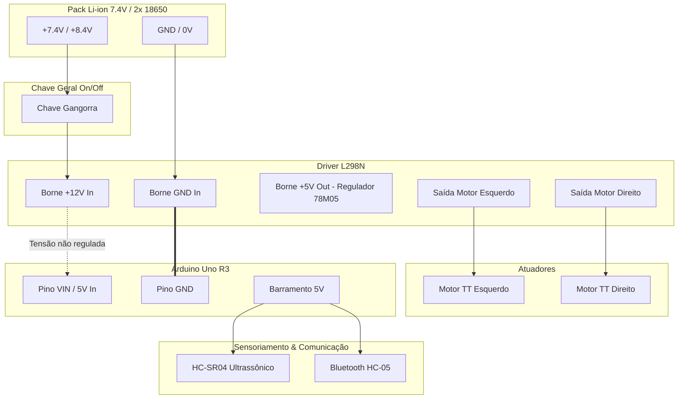

# ⚡ Arquitetura Eletroeletrônica e Esquema de Conexões

> **Referência:** Integração de Hardware abordada na Aula 14 da disciplina *Project-based Maker Lab*

---

## 1. Mapeamento de Portas e Pinagem (Arduino Uno R3)

| Componente Periférico | Pino do Periférico | Pino no Arduino Uno | Função do Sinal |
| :--- | :---: | :---: | :--- |
| **Driver L298N** | `ENA` | `D5` (PWM) | Controle de Velocidade Motor Esquerdo |
| **Driver L298N** | `IN1` | `D6` | Direção Sentido Horário Motor Esquerdo |
| **Driver L298N** | `IN2` | `D7` | Direção Sentido Anti-horário Motor Esquerdo |
| **Driver L298N** | `IN3` | `D8` | Direção Sentido Horário Motor Direito |
| **Driver L298N** | `IN4` | `D9` | Direção Sentido Anti-horário Motor Direito |
| **Driver L298N** | `ENB` | `D10` (PWM) | Controle de Velocidade Motor Direito |
| **Sensor HC-SR04** | `VCC` | `5V` | Alimentação Lógica Sensor |
| **Sensor HC-SR04** | `GND` | `GND` | Referência Elétrica |
| **Sensor HC-SR04** | `TRIG` | `D12` | Pulso de Disparo Ultrassônico (10 µs) |
| **Sensor HC-SR04** | `ECHO` | `D11` | Leitura do Tempo de Retorno da Onda |
| **Bluetooth HC-05** | `VCC` | `5V` | Alimentação Módulo Bluetooth |
| **Bluetooth HC-05** | `GND` | `GND` | Referência Elétrica |
| **Bluetooth HC-05** | `TXD` | `D2` (SoftSerial RX)| Recepção de Comandos do Smartphone |
| **Bluetooth HC-05** | `RXD` | `D3` (SoftSerial TX)| Divisor de tensão 5V->3.3V (1kΩ / 2kΩ) |

---

## 2. Diagrama de Distribuição de Potência e Aterramento

> [!IMPORTANT]
> **GND Comum Obrigatório:** O polo negativo da bateria (GND da Ponte H) deve estar obrigatoriamente interligado ao GND do Arduino para manter a mesma referência de sinal lógico TTL.

---

## 3. Considerações sobre Ruído Elétrico e Proteção

1. **Capacitores de Desacoplamento:** Recomendado adicionar capacitor cerâmico de 100 nF soldado diretamente nos terminais de cada motor TT amarelo para absorver centelhamento e transientes elétricos das escovas.
2. **Divisor de Tensão no RX do Bluetooth:** Como o pino RX do HC-05 opera em 3.3V, utiliza-se um divisor resistivo simples ($R_1 = 1\text{ k}\Omega$, $R_2 = 2\text{ k}\Omega$) entre a saída `D3` (5V) do Arduino e o pino `RX` do módulo.
3. **Isolamento Óptico:** O chip L298N possui circuito interno que protege o microcontrolador contra picos de força contra-eletromotriz (*Back-EMF*) gerados durante a frenagem ou reversão dos motores.
