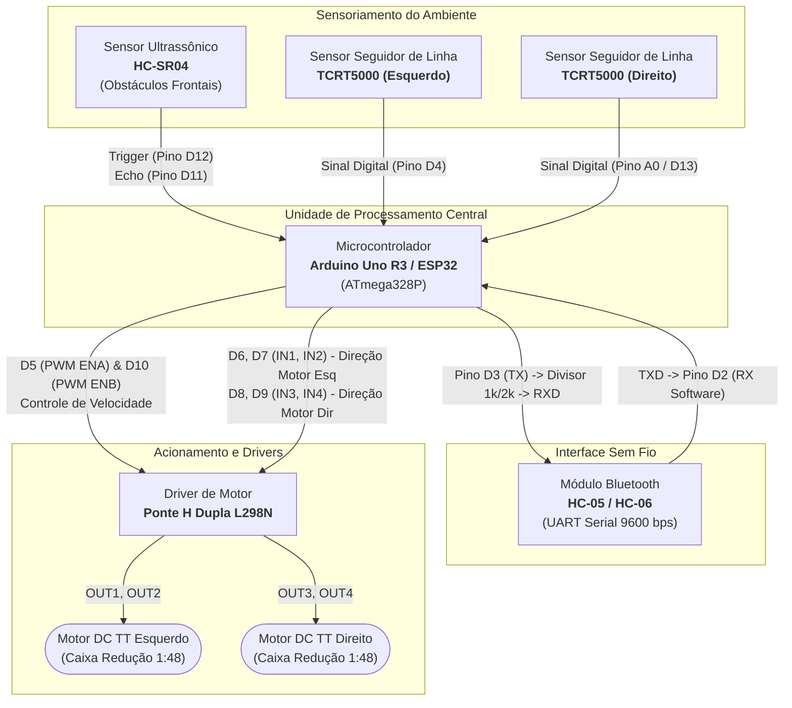
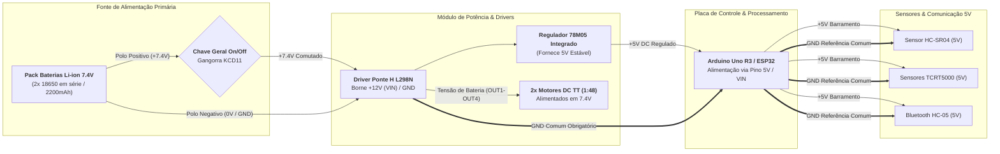

# ⚡ Arquitetura Eletroeletrônica e Esquema de Conexões

> **Referência:** Integração de Hardware abordada na Aula 14 da disciplina *Project-based Maker Lab* (FIAP)

---

## 1. Mapeamento de Portas e Pinagem (Arduino Uno R3 / ESP32)

| Componente Periférico | Pino do Periférico | Pino no Arduino Uno | Pino no ESP32 *(Opção)* | Tipo de Sinal | Função do Sinal |
| :--- | :---: | :---: | :---: | :---: | :--- |
| **Driver L298N** | `ENA` | `D5` (PWM) | `GPIO 14` (PWM) | Digital (PWM ~980Hz) | Controle de Velocidade Motor Esquerdo |
| **Driver L298N** | `IN1` | `D6` | `GPIO 27` | Digital Output | Direção Sentido Horário Motor Esquerdo |
| **Driver L298N** | `IN2` | `D7` | `GPIO 26` | Digital Output | Direção Sentido Anti-horário Motor Esquerdo |
| **Driver L298N** | `IN3` | `D8` | `GPIO 25` | Digital Output | Direção Sentido Horário Motor Direito |
| **Driver L298N** | `IN4` | `D9` | `GPIO 33` | Digital Output | Direção Sentido Anti-horário Motor Direito |
| **Driver L298N** | `ENB` | `D10` (PWM) | `GPIO 32` (PWM) | Digital (PWM ~490Hz) | Controle de Velocidade Motor Direito |
| **Sensor HC-SR04** | `VCC` | `5V` | `VIN (5V)` | Alimentação | Tensão de Operação 5V |
| **Sensor HC-SR04** | `GND` | `GND` | `GND` | Referência | Terra Elétrico Comum |
| **Sensor HC-SR04** | `TRIG` | `D12` | `GPIO 13` | Digital Output | Pulso de Disparo Ultrassônico (10 µs) |
| **Sensor HC-SR04** | `ECHO` | `D11` | `GPIO 12` | Digital Input | Leitura do Tempo de Retorno da Onda |
| **Sensor TCRT5000 (Esq)** | `DO` | `D4` | `GPIO 18` | Digital Input | Leitura Digital de Pista (Preto/Branco) |
| **Sensor TCRT5000 (Dir)** | `DO` | `A0` / `D13` | `GPIO 19` | Digital Input | Leitura Digital de Pista (Preto/Branco) |
| **Bluetooth HC-05** | `VCC` | `5V` | `VIN (5V)` | Alimentação | Tensão de Operação 5V |
| **Bluetooth HC-05** | `GND` | `GND` | `GND` | Referência | Terra Elétrico Comum |
| **Bluetooth HC-05** | `TXD` | `D2` (SoftSerial RX)| `GPIO 16` (UART2 RX) | Digital Input | Recepção de Comandos do Smartphone |
| **Bluetooth HC-05** | `RXD` | `D3` (SoftSerial TX)| `GPIO 17` (UART2 TX) | Digital Output | Transmissão (Divisor 5V->3.3V) |

---

## 2. Diagrama de Blocos do Sistema (Lógica e Conexões de Controle)

---

## 3. Diagrama de Distribuição de Potência (*Power Tree*)

> [!IMPORTANT]
> **GND Comum Obrigatório:** O polo negativo da bateria (GND da Ponte H) deve estar obrigatoriamente interligado ao GND do Arduino para manter a mesma referência de sinal lógico TTL.

### Baterias Consideradas para o Projeto:
1. **Opção Principal (Recomendada):** Pack com **2x Células Li-ion 18650** em série:
   - Tensão Nominal: $7.4\text{ V}$ (Totalmente carregada: $8.4\text{ V}$)
   - Capacidade Típica: $2200\text{ mAh} \sim 4400\text{ mAh}$
   - Justificativa: Alta densidade energética, peso reduzido e excelente taxa de descarga contínua para os motores.
2. **Opção Secundária (Compatível):** Suporte para **4x Pilhas AA Alcalinas** ($6.0\text{ V}$) ou **6x Pilhas AA NiMH** ($7.2\text{ V}$).

---

## 4. Considerações sobre Ruído Elétrico e Proteção

1. **Capacitores de Desacoplamento:** Adição de capacitor cerâmico de $100\text{ nF}$ soldado diretamente nos terminais de cada motor TT amarelo para absorver centelhamento e transientes elétricos gerados pela comutação das escovas.
2. **Divisor de Tensão no RX do Bluetooth:** Como o pino RX do módulo HC-05 opera em nível lógico de $3.3\text{ V}$, utiliza-se um divisor resistivo ($R_1 = 1\text{ k}\Omega$, $R_2 = 2\text{ k}\Omega$) entre a saída `D3` ($5\text{ V}$) do Arduino e o pino `RX` do módulo para evitar danos térmicos no chip Bluetooth.
3. **Isolamento de Corrente Reversa (Flyback Diodes):** O circuito da Ponte H L298N conta com uma ponte de 8 diodos de roda-livre (*flyback*) que absorve picos indutivos de força contra-eletromotriz (*Back-EMF*) gerados durante a reversão de giro e frenagem dos motores.
4. **Isolamento do Barramento Lógico:** A alimentação dos motores não passa pelas trilhas do microcontrolador Arduino, garantindo que picos de torque e corrente elevada ($\sim 1\text{ A}$ por motor sob partida/travamento) não causem *brownout* ou *reset* inesperado no processador.
